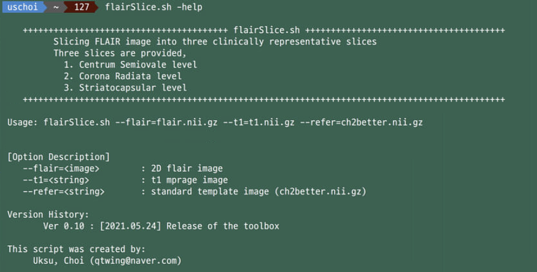

# <font size=6><br>_**flairSlice.sh</br></font> <font size=3>Normalized FLAIR slice generation pipeline script**_</font>


## Description
+ FLAIR image into three normalized representative leveled slices
+ Outputs are three clinically normalized representative FLAIR image and slices
+ The script was tested on <b>_bash_</b> and <b>_MacOS_</b>


## Install requirements
### &nbsp;&nbsp;&nbsp;_ANTs_
&nbsp;&nbsp;&nbsp;&nbsp;You need to install [ANTs](https://github.com/ANTsX/ANTs) to use this script.<br>
### &nbsp;&nbsp;&nbsp;_FSL_
&nbsp;&nbsp;&nbsp;&nbsp;You need to install [FSL](https://fsl.fmrib.ox.ac.uk/fsl/fslwiki) to use this script.<br>
### &nbsp;&nbsp;&nbsp;_AFNI_
&nbsp;&nbsp;&nbsp;&nbsp;You need to install [AFNI](https://afni.nimh.nih.gov/) to use this script.<br>


## Download template files
&nbsp;&nbsp;&nbsp;&nbsp;You need to download template files [Template](https://github.com/stnava/DynANTs/tree/master/template) into ${FSL_DIR}/data/standard/ directory<br>


## Usage
+ <b>Run in Terminal</b>
```
flairSlice.sh --flair=flair.nii.gz --t1=t1.nii.gz --refer=ch2better.nii.gz
```
+ <b>Help</b>
```
flairSlice.sh -help
```


## Inputs
* <font size=4>_2D FLAIR Image_</font>


* <font size=4>_3D T1w Image_</font>


* <font size=4>_Templated Image_</font>


## Outputs
* <font size=4>_Registered FLAIR Slices_</font>


* <font size=4>_Registered FLAIR image_</font>


## Version history
+ Version 0.1: the script release (2021.05.24)

## _Contact for Feedback and Bug Reports_
_Uksu, Choi (qtwing@naver.com)_
